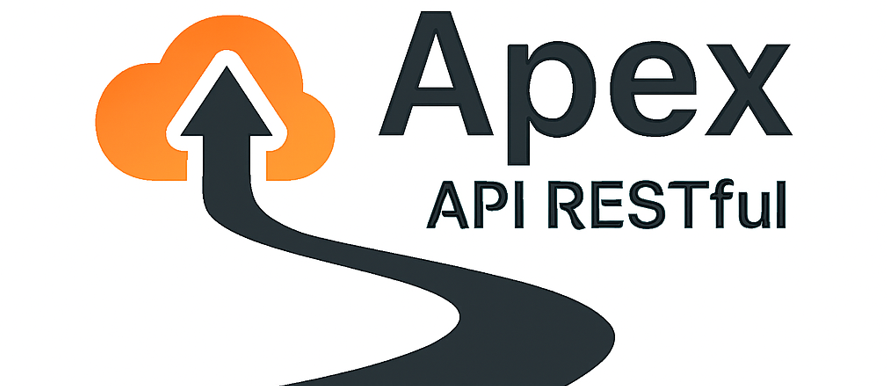

# Apex Transport API

Assim como no automobilismo, a Apex busca o ponto ideal entre **velocidade, precisão e estabilidade**, oferecendo uma estrutura **limpa, eficiente, testável e altamente manutenível** para o domínio de entregas. 

Uma solução modular voltada para **gestão de entregas e transportadores**, desenvolvida com **Clean Architecture em .NET**, projetada para escalar com **camadas independentes e dependências invertidas**.

## 🔗 Rotas Importantes

### 🧩 AuthApex API
- **Swagger UI:** [https://localhost:5001/swagger](https://localhost:5001/swagger)  
- **Scalar UI (opcional):** [https://localhost:5001/scalar](https://localhost:5001/scalar)

### 🚚 TransportApex API
- **Swagger UI:** [https://localhost:5112/swagger](https://localhost:5112/swagger)  
- **Scalar UI (opcional):** [https://localhost:5112/scalar](https://localhost:5112/scalar)

> 💡 **Observação:**  
> A interface **Scalar** oferece uma experiência visual muito mais agradável e intuitiva que o Swagger tradicional — vale a pena explorar para testar e visualizar as APIs de forma moderna e fluida.


## 🛠️ Setup automático

Ao executar a aplicação, o banco de dados e suas tabelas são **criados automaticamente** via Entity Framework Core. Não é necessário rodar comandos manuais — as migrações são aplicadas na inicialização, facilitando o processo de clonagem e execução do projeto sem esforço adicional, já que este projeto é destinado apenas a testes em ambiente de desenvolvimento.

## 🧭 Visão Geral  

A API fornece uma base sólida para operações de **autenticação, cadastro de usuários, cadastro e listagem de fornecedores, produtos e entregas**, garantindo **segurança, performance e confiabilidade** em cada requisição.

O projeto é dividido em **microsserviços independentes** — como:
- **AuthApex API** → responsável por autenticação e geração de tokens JWT  
- **TransportApex API** → responsável por fornecedores, rotas e entregas  

Essa separação permite **evolução contínua** sem comprometer a integridade da aplicação.

## 🧩 Requisitos e Tecnologias Principais  
- 🖥️ **Linguagem:** C# (.NET 9.0)
- 🖥️ **Banco de dados:** Sql Server
- 🧱 **Estrutura da solução:** arquivo `Apex.sln` no nível raiz  
- 🧮 **Organização modular:** múltiplos projetos representando as camadas da arquitetura limpa  


## 🏗️ Arquitetura Limpa (Clean Architecture)

### ⚙️ Princípios adotados  
- **Dependências voltadas para dentro:** camadas externas conhecem as internas, mas não o contrário.  
- **Domínio isolado:** entidades e regras de negócio independentes de frameworks, UI ou banco de dados.  
- **Camada de aplicação:** casos de uso orquestram a lógica e dependem apenas de abstrações.  
- **Infraestrutura:** implementa detalhes concretos (persistência, serviços externos, etc).  
- **Transporte (API/UI):** depende apenas da camada de aplicação e domínio, não da infraestrutura.

### 🧠 Estrutura aplicada no projeto  
- **Domínio:** entidades e regras puras de negócio.  
- **Aplicação:** casos de uso, DTOs e interfaces de repositório.  
- **Infraestrutura:** implementações concretas de persistência e serviços externos.  
- **Transporte/API/UI:** controllers, endpoints e modelos de entrada/saída.  
- **Inversão de dependência:** o núcleo define as interfaces, e as camadas externas as implementam.

### 💡 Benefícios  
- Testes de unidade simplificados.  
- Manutenção facilitada e desacoplada da infraestrutura.  
- Escalabilidade e adaptação a novas tecnologias.  
- Clareza e separação de responsabilidades entre camadas.  


## 🗂️ Estrutura de Pastas  

```text
Apex/
├─ AuthApex/
│  ├─ src/
│  │  ├─ AuthApex.Application/
│  │  ├─ AuthApex.Domain/
│  │  ├─ AuthApex.Infrastructure/
│  │  └─ AuthApex.WebApi/
│  └─ tests/
│     ├─ AuthApex.Domain.UnitTests/
│     ├─ AuthApex.Application.UnitTests/
│     ├─ AuthApex.Application.FunctionalTests/
│     └─ AuthApex.Infrastructure.IntegrationTests/
├─ Shared
│  ├─ Apex.Shared/
│  │  ├─ Constants/
│  │  ├─ Enums/
│  │  ├─ Interfaces/
│  │  ├─ Results/
│  │  ├─ Settings/
├─ TransportApex/
│  ├─ src/
│  │  ├─ TransportApex.Application/
│  │  ├─ TransportApex.Domain/
│  │  ├─ TransportApex.Infrastructure/
│  │  └─ TransportApex.WebApi/
│  └─ tests/
│     ├─ TransportApex.Domain.UnitTests/
│     ├─ TransportApex.Application.UnitTests/
│     ├─ TransportApex.Application.FunctionalTests/
│     └─ TransportApex.Infrastructure.IntegrationTests/
├─ Apex.sln
└─ README.md
```


## 🏃‍♂️ Como Executar  

1. **Clone o repositório:**  
   ```bash
   git clone https://github.com/brnpalma/Apex.git
   ```  
2. **Abra a solução** `Apex.sln` no Visual Studio ou IDE compatível.  
3. **Defina o projeto de inicialização**, um perfil chamado `WebApis` já foi criado com a seleção das duas APIs juntas, facilitando a execução.  
4. **Restaure pacotes NuGet**, compile e execute.  
5. **Strings de conexão** já estão devidamente configuradas para se conectar com seu SqlServer local.  
6. **Acesse o Swagger UI ou Scalar** no navegador para testar os endpoints.  

> 💡 **Importante:**  
> Após a autenticação, para realizar requisições protegidas, não é necessário incluir o prefixo `Bearer` antes do token. Basta informar o JWT diretamente no campo de autorização. A aplicação já está preparada para interpretar o token de forma automática.


## 📐 Convenções e Boas Práticas  

- ✳️ **Nomeação clara:** `Entities` no Domínio e `UseCases` na Aplicação.  
- 🧩 **Interfaces** iniciam com `I` (ex: `IUsuariorRepository`).  
- 🚫 **Domínio nunca depende** diretamente de infraestrutura.  
- 🔄 **Use DTOs** para mapeamento entre UI e Domínio.  
- 🗃️ **Organização rígida por responsabilidade:** mantendo a separação por camadas.  


## 📚 Referência de Boas Práticas - Dependências Externas 
> Este projeto segue princípios de desenvolvimento limpo e legível inspirados no livro _Clean Code: A Handbook of Agile Software Craftsmanship_, de Robert C. Martin.


## 🤝 Contribuindo  

Contribuições são bem-vindas!  
1. Faça um **Fork** do repositório.  
2. Crie um branch: `feature/nova-funcionalidade`.  
3. Faça commits claros e limpos.  
4. Abra um **Pull Request** descrevendo suas alterações.


## 👤 Contato  
🔧 **Desenvolvedor:** Bruno Palma  
📧 **E-mail:** [br88@outlook.com](br88@outlook.com)
